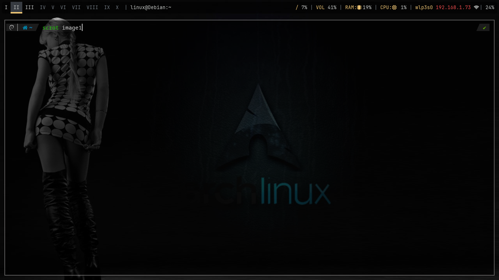
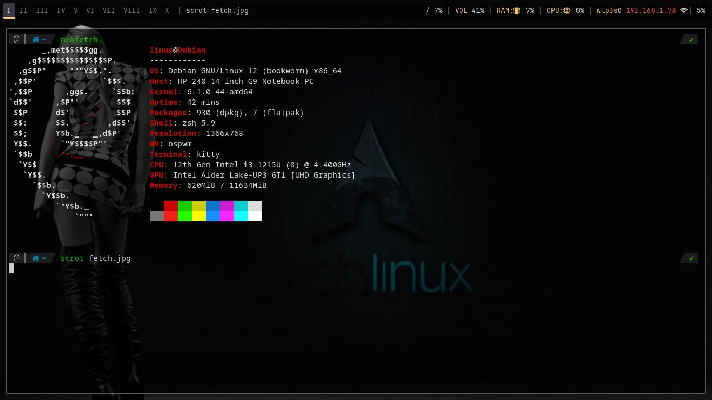

# BSPWM-Setup Automatizado

Un script en Bash para la instalación y configuración automatizada del entorno de escritorio BSPWM en un sistema **Debian Minimal (Netinstall)** partiendo desde una TTY sin entorno gráfico.

## Descripción

Este repositorio contiene las configuraciones (`dotfiles`) y un script de instalación (`bspwm.sh`) diseñados para desplegar rápidamente un flujo de trabajo minimalista y eficiente basado en:

* **Window Manager:** `bspwm`
* **Hotkeys:** `sxhkd`
* **Bar:** `polybar`
* **Compositor:** `picom`
* **Terminal:** `kitty`
* **Application Launcher:** `rofi` 
* **Fuentes y Iconos:**`JetBrains Mono`

## Capturas de pantalla 



## Requisitos Previos
* Una instalación base de Debian (Estable o Testing) sin entorno gráfico.
* Conexión a internet estable.
* Privilegios de `sudo`.

## Instalación

1.  **Clona el repositorio:**
	```bash
      git clone https://github.com/sysgastel/bspwm-setup.git cd bspwm-setup
	```
2.  **Haz ejecutable el script:**
	```bash
        chmod +x bspwm.sh
	```
3.  **Ejecuta el script de instalación:**
	```bash
      bash ./bspwm.sh
	```
**Nota:** Durante la instalación, se te pedirá tu contraseña de `sudo`. El script instalará todas las dependencias necesarias y moverá los archivos de configuración a sus ubicaciones correspondientes (`~/.config/`).

## Contenido del Repositorio

* **`bspwm.sh`:** Script principal para la automatización de la instalación.
* **`dot-files/`:** Directorio que contiene las configuraciones personalizadas para cada herramienta (bspwm, sxhkd, polybar, picom, etc.)

## Este proyecto es parte de mi camino para convertirme en Administrador de Sistemas Linux
## Habilidades aplicadas
* **Bash Scripting**
* **automatizacion de despliegue y manejo de archivos**
* **Linux Sysadmin**
* **Gestion de entorno Minimal y personalizacion**
* **Git/Github**

## Informacion de contacto:
* **Miguel Angel Gastelum**
* **https://github.com/sysgastel**
* **Administrador de Sistemas GNU/Linux**

